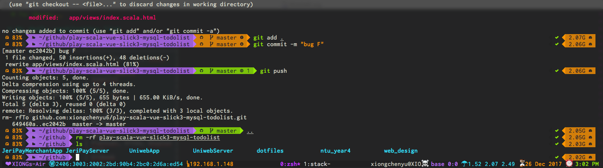

# Dotfiles Settings

This is my settings use nix and nixos.

<figure id="fig:1">

<figcaption>Terminal Previews</figcaption>
</figure>

## Usage

### For Macos

To use this simple run the brew.bash installation shell script.

### For Nixos

To use the apt.bash installation shell script

### For arch linux

``` shell
pacman -S --needed - < pkglist.txt
```

## My daily application list

| Usage              | Application                     |
|--------------------|---------------------------------|
| Email              | <imap:mbsync> <smtp:msmtp> gnus |
| Crypt              | gnu2 sops                       |
| Editor             | Emacs, neovim                   |
| Shell              | Zsh                             |
| Shell manager      | Oh-my-zsh                       |
| Searcher           | rg, atuin                       |
| Termial            | alacritty                       |
| Chat               | QQ, Wechat, Erc                 |
| Presentation       | Reveal.js                       |
| GTD                | Org Agenda                      |
| Notes              | Org Roam                        |
| Graph Draw         | Plantuml, Ditaa, Gnuplot        |
| Documentation View | Dash                            |
| Book Writing       | Gitbook                         |
| Finance            | Ledger                          |
| Auto Deploy        | Systemd, Docker                 |
| Academic Writing   | Pandadoc, Org mode              |
| Desktop            | Xmonad -\> hyprland             |

## Tips for the Chinese settings problem on Ubuntu

This is how to set up Chinese input in Ubuntu

``` shell
gsettings set org.gnome.desktop.input-sources sources "[('xkb', 'us'), ('ibus', 'Unikey')]"
```

## My roadmap

I did love and enjoy the key-bindings of vim, from the day I switch from
the emacs, but I switch back shortly because of the 2 main reasons.

1.  Emacs plugins works on my windows but the my vim got some problem
    and I have to dirty my configuration files so much to fixed.
2.  I need to use playframework for development and the emacs support
    ensime very well.

I move from emacs to vim then to neovim and now I am using the
spacemacs, I think the configuration for everyone will become the same
after long period of learning and copying from others, so it is good to
give the community driven software a try.

## Gist to immigrate my private keys

``` shell
cp /path/to/backups/*.gpg ~/.gnupg/
#Inport gpg
gpg --import-ownertrust chrisroos-ownertrust-gpg.txt
```


## Windows Wsl2
